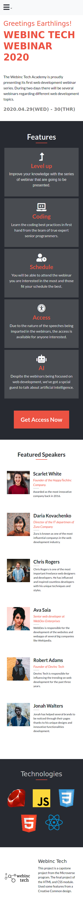
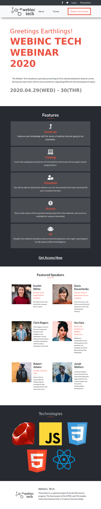
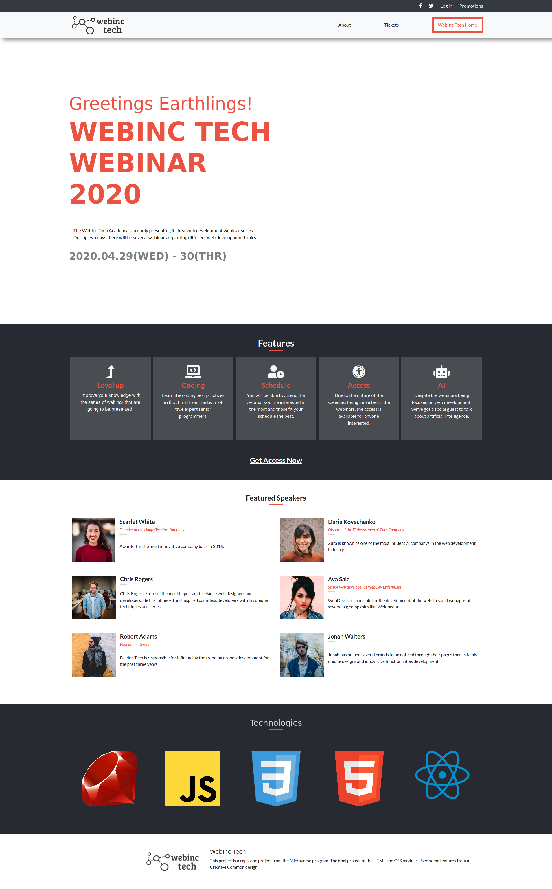

# Microverse Capstone project - Global Summit
## Webinar page

This is the capstone project of HTML and CSS module from the Microverse project. The idea behind the project is to test our knowledge, polish and hone our technical skills to be the best developers we could possibly be.

This version of the capstone is about building a web page that looks as close as possible as the  [Global Summit](https://www.behance.net/gallery/29845175/CC-Global-Summit-2015) conference page

### Project requirements

The project requires to use design elements from the [Global Summit](https://www.behance.net/gallery/29845175/CC-Global-Summit-2015) page, which uses a Creative Common license which allows me to use most of the elements of the design.

The project also requires me to to customize the content, in this case I choosed a webinar promotion website.

The other requirements are:
- Three pages minimum (Home page, About page and Tickets page).
- Two layouts, one for desktops (above 768px wide) and one for mobile devices (below 768px wide).
- The use of the colors, and fonts form the original website.

### Technologies used

To create this website I used the following technologies:
- [Bootstrap](https://getbootstrap.com/) framework to layout most of the project pages and to style some of the project's elements.
- [Fontawesome](https://fontawesome.com/) to simplify the process of styling the icons used in the project.
- [GIMP](https://www.gimp.org/) to crop and edit the images used in this project.
- [Background removal](https://www.remove.bg/) to fasten the process of background removal from certain images and icons.

### Pictures of the layouts

#### Mobile

#### Desktop (768px)

#### Destop (1200px)

### Credits

The credits for the design goes to [Cindy Shin](https://www.behance.net/adagio07) and [Creative Commons](https://creativecommons.org/). She had all the credit for the original design, the colors and typography, I just made use of some of its elements.

### Live previews

- [Production](https://rawcdn.githack.com/alvp01/webinar-page/fdfe32e8f1f931a5095b7b3c14ace7a62c5bff48/index.html)
- [Development](https://raw.githack.com/alvp01/webinar-page/pages-queries-content/index.html)

### Developer
[Abel](https://github.com/alvp01)
